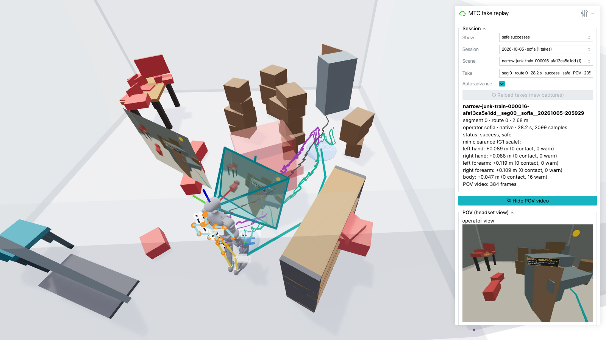
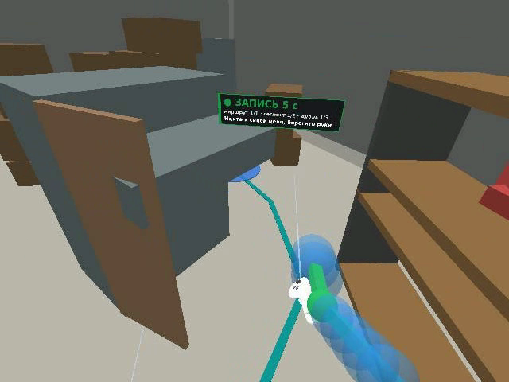
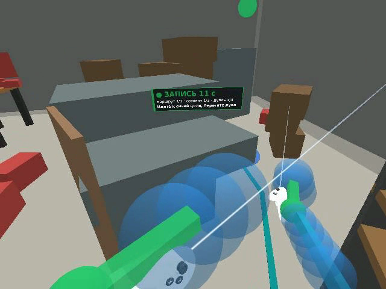
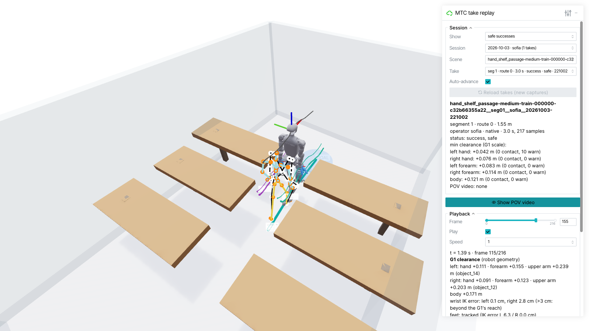
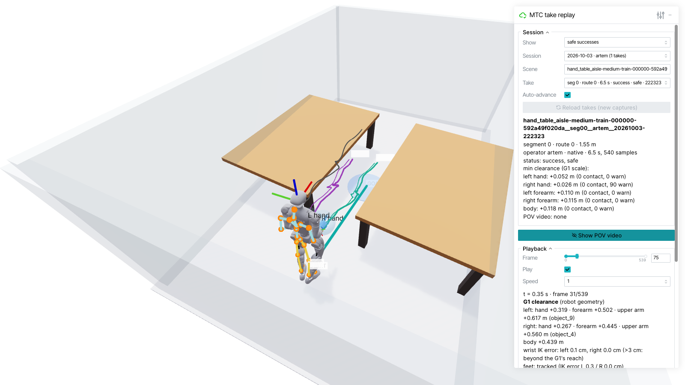

# custom-teleop-room

VR teleoperation capture for the **Unitree G1** in cluttered rooms, using a **PICO 4 Ultra**.
An operator wearing the headset walks through a virtual room (tables, shelves, boxes, junk)
shown at G1 scale. The headset records head, wrist and full-body tracking. While the take is
recorded, the robot's own collision shapes (Dex3 hands, forearms, body) are checked against the
furniture, so the operator learns to move the way the robot has to: upright, with the hands kept
clear of obstacles.

The result is a dataset of walk-throughs (`takes/`) for training whole-body and hand-protection
policies in [Click-and-Traverse](https://github.com/Skvayzer/Click-and-Traverse). The repo also has
a 3D viewer for replaying each take on the G1.

<p align="center">
  
  <br><em>Replaying a take in a narrow junk room: G1 meshes driven by the operator's tracking,
  hand and wrist trails, per-part clearance, and the synced video from the PICO headset.</em>
</p>

## In the headset

The operator sees the room drawn by the native PICO app (XRoboToolkit + the MTC layer in
[`mtc_capture/native/`](mtc_capture/native/)). The teal strip on the floor is the route, the blue
pad is the goal, and a status panel follows the gaze (`ЗАПИСЬ 11 с` means recording, 11 s). The
translucent capsules are the **G1's Dex3 hand envelopes** scaled to the operator. Furniture turns
orange when one of them comes within 5 cm and red on contact.

| Following the route | Robot hand envelopes on the controllers |
|---|---|
|  |  |

*Frames from a take's `pov.mp4`, which the app renders and streams to the capture computer at
640×480, 15 fps.*

## Replaying takes

`view_take` serves a browser-based 3D viewer (Viser). It has filters for session, scene and take,
auto-advance along a route, and a timeline. Per frame it reports the G1's clearance (hand,
forearm, upper arm, body), the IK error of the wrists, and whether the feet are tracked.

| Shelf passage | Table aisle (playback panel) |
|---|---|
|  |  |

Colours: the purple and teal trails are the left and right wrists. The orange/yellow figure is
PICO's 24-joint body skeleton at G1 scale. The grey figure is the G1, posed by arm IK
(`arm_ik.py`), with its feet following the tracked ankles. The robot's links turn blue, orange or
red with their clearance.

## How it works

```
PICO 4 Ultra: XRoboToolkit-MTC app                            capture computer
  head, controllers (wrists), 24 body joints  --ws :8013-->   native_app.py -> capture.py -> takes/<id>/
  + POV video (JPEG frames)                                     |  clearance.py: G1 shapes vs furniture
  room, status panel, sound cues  <--------------------------   '  (UDP beacon on :8014 announces the host)

takes/<id>/  --view_take.py-->  Viser 3D replay in the browser (:8110)
```

- **Scenes**: generated rooms (`narrow_rooms.py`, `messy_rooms.py`, `chaotic_rooms.py`, and the
  Click-and-Traverse furniture generators). They are split into short route segments that fit a
  real 5.5 × 3 m floor. Each segment starts on the operator's home spot.
- **Scale**: alpha = 1.32 / operator height. The room is scaled by 1/alpha, so the operator has
  the G1's proportions.
- **Tracking**: PICO body tracking with two ankle Motion Trackers gives the legs. The controllers,
  held in the hands, give the wrists, which stay tracked while the operator looks ahead. A
  glitch filter drops controller jumps.
- **Live safety check**: each tracking sample, the Dex3 hand capsule, forearm capsule, torso,
  head and shoulders are measured against every box in the room.

## Repository layout

```
mtc_capture/
  capture.py             main capture loop (scenes, segments, calibration, takes)
  native_app.py          WebSocket link to the PICO app (protocol in native/README.md)
  sources.py             tracking sources + controller glitch filter
  clearance.py           G1 collision proxy vs room boxes
  arm_ik.py, g1_body.py  G1 arm IK and body dimensions
  narrow_rooms.py, messy_rooms.py, chaotic_rooms.py, furniture.py, make_scene_set.py   scene generation
  view_take.py           3D take replay (Viser)          <- visualisation
  view_scenes.py         3D scene-set browser (Viser)
  spectator.py           live MuJoCo / MJPEG view of the running capture
  replay.py              render a take to replay.mp4
  preflight.py, status.py, run_capture.sh, tracker_trial.py, native_trial.py
  native_fake_headset.py scripted fake headset for testing without hardware
  vr_app.py, xr_body.js, xr_feedback.js, hud.py           browser (WebXR) capture path
  native/
    install_into_fork.sh copies the Unity layer into XRoboToolkit-Unity-Client
    unity/Assets/MtcCapture/   C# layer: MtcLink, MtcBody, MtcScene, MtcHud, MtcPov, MtcThirdPerson, MtcSounds
docs/images/             screenshots used here
```

## Setup

`mtc_capture` is a Python package inside a
[Click-and-Traverse](https://github.com/Skvayzer/Click-and-Traverse) checkout. It imports
`cat_ppo` and `view_furniture.py` from there, and reads and writes `data/mtc_capture/`. Put this
folder at the root of that checkout:

```bash
git clone https://github.com/Skvayzer/Click-and-Traverse.git
git clone https://github.com/Gamershmidt/custom-teleop-room.git
cp -r custom-teleop-room/mtc_capture Click-and-Traverse/
cd Click-and-Traverse
```

Environments:
- **capture**: numpy, aiohttp, mujoco, Pillow, opencv, pyzmq, plus `televuer`/`vuer` for the
  browser path. `run_capture.sh` sources `$MTC_ENV` (default `~/Documents/teleop/env.sh`).
- **viewer**: a separate venv from `requirements/furniture-visuals.txt` (`viser==1.1.0`, ...),
  conventionally `.visual-venv/`.

### 1. Build and install the PICO app (once)

```bash
git clone https://github.com/XR-Robotics/XRoboToolkit-Unity-Client.git ~/src/XRoboToolkit-Unity-Client
mtc_capture/native/install_into_fork.sh ~/src/XRoboToolkit-Unity-Client
# open in Unity 2022.3.16f1, platform Android, build the APK, then:
adb install -r XRoboToolkit-MTC.apk
```

The app finds the capture computer by itself through a UDP beacon. If broadcasts are blocked, push
an `mtc_host.txt` file with the host address (see [native/README.md](mtc_capture/native/README.md)).

### 2. Check tracking (2 min, nothing is recorded)

```bash
python -m mtc_capture.tracker_trial --native     # ends with VERDICT: OK and a --wrist-offset to use
```

### 3. Capture a session

```bash
mtc_capture/run_capture.sh <operator> <height_m> --native [--wrist-offset X Y Z] [--space 5.5 3.0]
python -m mtc_capture.status                     # progress per scene family
```

In the headset: stand on the home spot and hold **both triggers + both grips for 1 s** to
calibrate. Then step onto the start pad facing the goal, and walk the teal route when the panel
turns green. Assistant keys (type + Enter): `x` abort · `d` discard last take · `n` next segment ·
`b` calibrate the Motion Trackers · `v` cycle the self view · `q` quit. The full checklist is in
[OPERATOR.md](mtc_capture/OPERATOR.md).

No headset? `python -m mtc_capture.native_fake_headset` plays the app against a running capture.

### 4. Visualise

```bash
# once per take: G1 meshes per scene + arm retarget (capture/branch env with MuJoCo)
python -m mtc_capture.view_take prepare --successful

# serve: every take under data/mtc_capture/takes, filterable in the UI
.visual-venv/bin/python -m mtc_capture.view_take serve                  # http://127.0.0.1:8110
.visual-venv/bin/python -m mtc_capture.view_take serve --show "all takes"
.visual-venv/bin/python -m mtc_capture.view_take serve data/mtc_capture/takes/<take_id>

# scene sets in 3D, and a live view of a running capture
.visual-venv/bin/python -m mtc_capture.view_scenes serve
python -m mtc_capture.spectator --serve                                 # http://<host>:8120
```

## Take format

`data/mtc_capture/takes/<scene_id>__seg<k>__<operator>__<YYYYmmdd-HHMMSS>/`

| file | contents |
|---|---|
| `motion.npz` | per-sample head pose, wrists (`{left,right}_wrist_xr`), controllers, elbows, `body_joints_xr` (N, 24, 4, 4), glitch flags, and per-part clearance `clear_*` in G1 metres |
| `meta.json` | status (`success` / `aborted` / `timeout` / `tracking_lost`), `safe`, scene and segment, alpha, operator height, `T_scene_from_xr`, tracking coverage, objects touched |
| `pov.mp4`, `pov.npz` | headset view video and its frame times |

`safe` means: success, no contact by the hands, forearms or body, and both hands tracked for at
least 90 % of the take. Every take is kept; filter on `safe` when training. The full key list
and frame conventions are in [mtc_capture/README.md](mtc_capture/README.md).

## More documentation

- [mtc_capture/README.md](mtc_capture/README.md): scenes, segments, the browser capture path, take format
- [mtc_capture/native/README.md](mtc_capture/native/README.md): the PICO app, its protocol, how touches are detected, tracking quality
- [mtc_capture/OPERATOR.md](mtc_capture/OPERATOR.md): session checklist for the operator and the assistant
